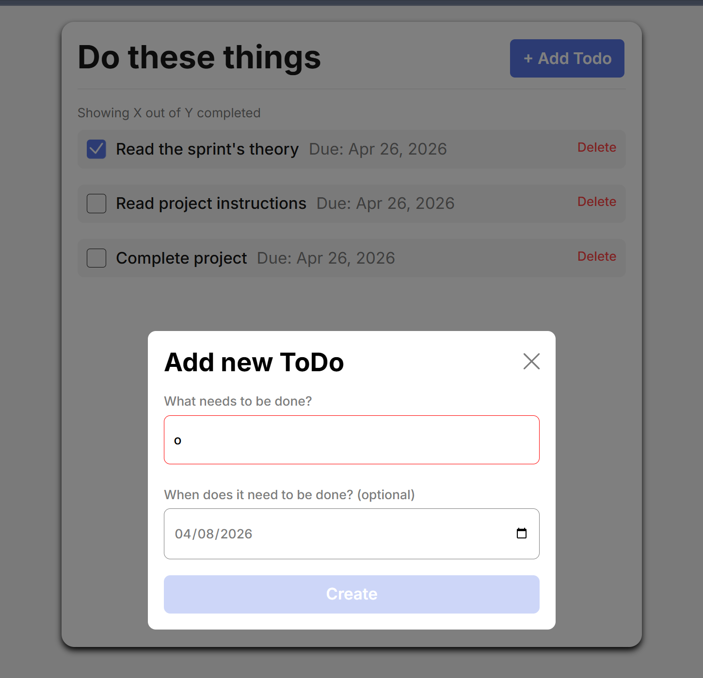
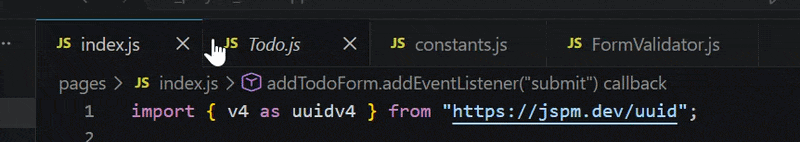
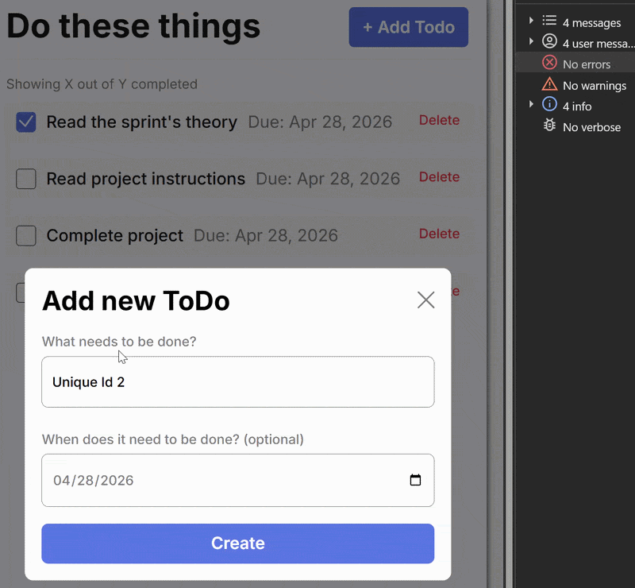

# Simple Todo App

For the todo app we focused on Object Orientated programming, Javascript classes, modules, and interfaces.

## Functionality

For the functionality using OOP we made updates to the project. To streamline the code into modules and allow functions to behave coorectly on the website.

## Technology

Formavalidation update example = If I try to create a new todo, if I for example enter in 1 letter the submit button will not be enabled.

I also updated the files structuring in vscode for the project.

Example -

I worked with classes, inheretance, ecapsulation, and polymorphism to make sure backend code worked properly with no console errors. Resulting in a functional website.

## Deployment

This project is deployed on GitHub Pages:

- [Sprint 7 Todo](https://ryanrenfrow.github.io/se_project_todo-app-mainfinal/)
